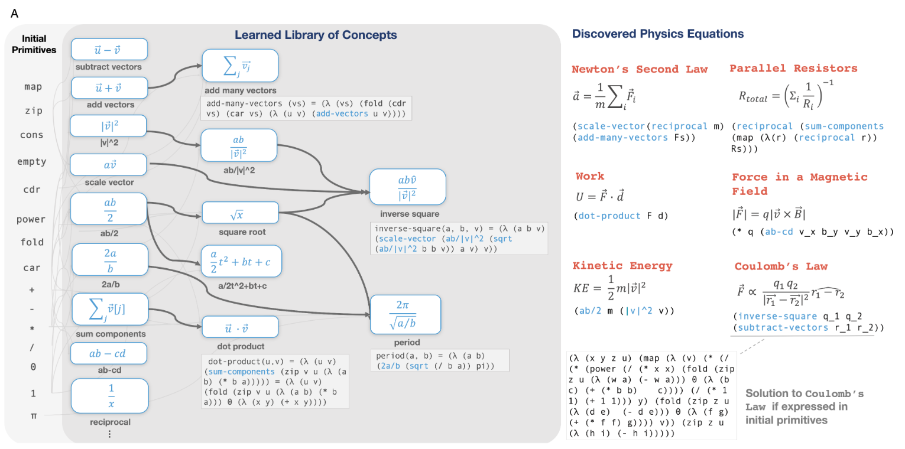

# DreamCoder
---

# Salient Features

* Motivation
* Problem definition
* Algorithm
* Experiments
* Results

---

## Motivation

Inductive Synthesis is the problem of finding a program $\rho$ in a DSL $l$ such that for a dataset $X$ and a specification $\Phi$:
$$
\bigwedge_{x \in X} \Phi(\rho, x)
$$
(+) Data Effiicient robust programs.
(+) Programs are interpretible by construction.
(-) Generally intractable. Performance depends on carefully engineering $l$ and search algorithm for each problem.
(-) Scalability limited by selection of $l$ and search algorithm

*Question*: Can we jointly learn $l$ and the search algorithm?

---

## Problem definition

We want to learn a library $L$ of functions in a DSL and a generative model over programs within the library $P[\rho | L]$ for a set of tasks $x \in X$.

* Dreamcoder (Wake): Search for bext program for task with current $L$.
$$
\rho_x = \arg\max_{\rho} \mathbf{P}[\rho | x, L] . \forall {x \in X}
$$
* Dreamcoder (Sleep Abstraction): Add common elements across programs to library.
$$
L = \arg\max_{L} P[L] \prod_{x \in X} \max_{\rho\text{ is refactoring of } \rho_x} P[\rho | x, L]
$$
* Dreamcoder (Sleep Dreaming): Learn to "fire" the new library.
$$
\text{Train } Q(p |x) \approx P[\rho | x, L]. x \sim X \cup L
$$

---
## Algorithm
```python
def skill_growing(obs: List[Pair[Image]], sandbox: RoboSim, grammar: List[Program]):
    recog_nn = NN()
    grammar = init_grammar() # L
    states = collect_dataset() # X
    for _ in ITERATIONS:
        # Wake Phase
        programs = []
        while not WAKE_TIMEOUT:
            i_state, o_state = states
            best_program = neural_search(i=i_state, o=o_state, lib=grammar, engine=recog_nn)
            programs.append(best_program)
        # Abstraction Phase
        libs = []
        while not COMPRESS_TIMEOUT:
            new_grammar = concat(refactor(subtrees(programs)))
            lib_score = eval_lib(lib=grammar, engine=recog_nn, data=states)
            if ( (lib_score - libs[-1][0]) < COMPRESS_THRESH ): break
            libs.append((lib_score, new_grammar))
        grammar = argmax(libs, key=0)
        # Dream Phase
        while not DREAM_TIMEOUT:
            fantasies = generate_programs(env=sandbox, lib=grammar)
            replays   = sample_solved_programs(data=states)
            train_data = fantasies + replays
            NN.train(recog_nn, i=train_data.task, o=train_data.program)
    return grammar # L
```
---
### Algorithm (As a picture)

<center>


</center>


---

## Experiments

Tasks:


For each task, collect a dataset of input-output examples and build an environment for the model to collect "fantasies" from.

Everything written in OCaml for fast multi-threaded execution.

---
## Results - Quantitative


---

## Results - Qualitative - List Processing


---

## Results - Qualitative - LOGO

<center>


</center>

---

## Results - Qualitative - LOGO

<center>


</center>


---

## Results - Qualitative - Physics





---

## Results - Qualitative - Robot block world

<center>


</center>

---

## Cons

- Dreamcoder requires *task engineering*.
- Refactoring requires an efficient implementation. Hard to do for differentiable grammars.
- How many wake/sleep cycles to use for a particular task?
- ??