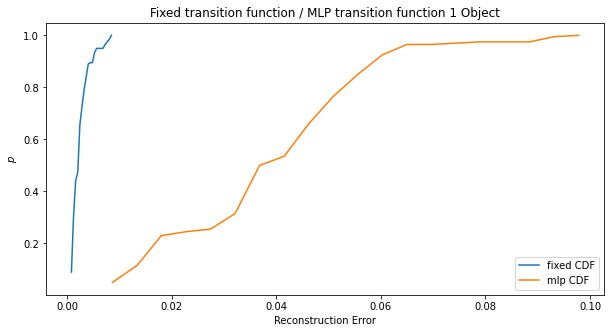

# Unsupervised Neural Representation Learning

---

# Agenda
 - Recap
 - Does a fixed program help the vision system?
    - Hypothesis
    - Experimental Results
 - Behavioral Keypoint Extraction for Shape World
 - Next Steps

---
# Recap

- *Paper Roadmap*: The perception component provides an information bottlebeck. The symbolic component allows us to inject prior knowledge. Moreover, we can learn both components simultaneiously.
- *Experiments*: Cartesian product of 2 perception engines and 2 datasets:
    - Behavioural KPD - Mice domain
    - Behavioural KPD - Shape-world domain
    - Slot Attention - Shape-world domain
    - (**Ill-posed**) Slot Attention - Mice domain
- TODO from last week:
    - Do we learn better neural representations with fixed prior knowledge?
        - Experimental results.
    - BKPD model's performamce on shapeworld?
        - Unknown behaviour of BKPD network on more than 2 objects. 

---

# Fixed Symbolic Rules

- Pure DNN based approaches struggle to disassociate shapes with colors.
    - The (shape, color) pairs in training is different from (shape, color) pairs in testing.
    - Sample 1 on next slide shows an effect of this disassociation on a purely neural model (with no rules).
- **Hypothesis**: Given a fixed transition function, can a hybrid neurosymbolic model produce better reconstructions and converge faster than a purely symbolic model.
    - Three models (reconstructiong $(s_i, a_i) \rightarrow (s_{i+1})$):
        - A vanilla resnet autoencoder 
        - A slot attention based autoencoder (with an MLP for the transition layer) 
        - A slot attention based autoencoder (with a fixed symbolic program for the transition layer) 
    - Compare metrics between these models.
---

# Experiments (1 object fixed dataset)


<style>
 .row {
  display: flex;
}

.column {
  flex: 50%;
} 
</style>


<div class="row">
  <div class="column">
# Experiment 1

*Methodology*: 
Train a slot autoencoder.
```
(img) --[Slot Enc]--> (x, y, shape, color) --[Slot Dec]--> (img)
```

Generate a dataset based on fixed transition function `T`.
Finetune two more networks using pretrained weights
1. with MLP as transition function
2. with `T` as transition function

Test on 200 unseen (shape, color) pairs.

  </div>
<div class="column">




MLP: Mean reconstruction error `0.0378`
```
(img_{i}) --[Slot Enc]--> (x, y, shape, color) -[MLP]-> (?x, ?y, ...) --[Slot Dec]--> (img_{i+1})
```


fixed: Mean reconstruction error `0.0024`
```
(img_{i}) --[Slot Enc]--> (x, y, shape, color) -[T]-> (x+1, y, ...) --[Slot Dec]--> (img_{i+1})
```

  
  </div>
</div> 

---


# Experiments  (1 object fixed dataset)

MLP mean perception error: `7.588`
Fixed mean perception error: `0.616`

w/ perception loss:

<center>


</center>

---


# Experiments  (3 object fixed dataset)

<center>


</center>


---


# Failure Cases?

- The test dataset introduces colors the model has never seen before.


---

# Next Steps

- The code for Behavioral KPD + Shapeworld compiles but takes 3+ days to finish 10 epochs. I need to run this on a larger machine and distribute compute across GPUs.
- I want to do one final check and train with lesser colors.

---

# Previous Slides

---

# Agenda:
 - Recap
 - How does slot attention handle occlusion:
    - Dataset
    - Results
 - Do symbolic rules "help" the vision system.
 - Next Steps
---

<!-- # Recap
- Slot Attention w/ gumbel softmax:
    - Dynamical learning with slot attention is  


--- -->

## Slot Attention - Occlusion Dataset

<center>


</center>

---
### Results

<center>


</center>

---

# Fixed Symbolic Rules

- Pure DNN based approaches struggle to disassociate shapes with colors.
    - The (shape, color) pairs in training is different from (shape, color) pairs in testing.
    - Sample 1 on next slide shows an effect of this disassociation on a purely neural model (with no rules).
- Hypothesis: Given a fixed transition function, can a hybrid neurosymbolic model produce better reconstructions and converge faster than a purely symbolic model.
    - Three models:
        - A vanilla resnet autoencoder reconstructiong $(s_i, a_i) \rightarrow (s_{i+1})$
        - A slot attention based autoencoder (with an MLP for the transition layer) reconstructiong $(s_i, a_i) \rightarrow (s_{i+1})$
        - A slot attention based autoencoder (with a fixed symbolic program for the transition layer) reconstructiong $(s_i, a_i) \rightarrow (s_{i+1})$

---

# Sample 1

<center>


</center>

---

# Dataset

<center>


</center>

---

# Next steps
 - Slot Attention w/ Occlusion on mice domain.
    - MABE Videos.
 - Results for the symbolic rule hypothesis.


 ---

 # Slides from Last Week

 ---

 # Slot Attn Decoder

<center>


</center>

---

# Changes


Changes:
 - Use smoothL1 loss instead of L1 loss.
 - Use the same loss function for matching and backprop.

<!-- 

<style> .container { display: flex; } .col { flex: 1; } </style>

<div class="container"> <div class="col">
Pipeline:

</div>
<div class="col">
Training curve:

</div>
</div> -->

---
# Slot Attn Decoder

Training Curve


---

# Sample 0

<center>


</center>

---

# Sample 1

<center>


</center>

---

# Sample 2

<center>


</center>

---

# Dealing with multiple objects

```ocaml

S0: s_i |> (enc) |> (slot)                                       (dec) |> s_{i+1}
S1:                        |> (entitiy dec) |> (a_i) |> (???) |>
```


---

# dPads

- Given a differentiable DSL, dPads aims to derive a program that maps an input stream to an output stream. 

- $$\arg\min_{\theta,\alpha} \mathbb{E}_{\mathbf{i, o} \in D} [l(P(\mathbf{i}; \alpha, \theta), \mathbb{o})] + c(\alpha) $$
- alpha is a program derivation graph


---

# DSL

Inputs:
```python
pos :: [int, int]
color :: int
shape :: {circ, sq, tri}
slot :: [color, shape, pos]
```

---


---

<style>
 .row {
  display: flex;
}

.column {
  flex: 50%;
} 
</style>

# Multi column template.
 <div class="row">
  <div class="column">

 - Recap
 - Failure Cases of SA on `poccluded-shapeworld` domain.
 - Does a fixed program help the vision system?
    - Hypothesis
    - Experimental Results (Model 1)
    - Experimental Results (Model 2)
    - Experimental Results (Model 3)
 - Behavioural Keypoint Extraction for Shape World
 - Next Steps
  </div>
  
  <div class="column">
  
  ```python
pos :: [int, int]
color :: int
shape :: {circ, sq, tri}
slot :: [color, shape, pos]
```

```python
pos :: [int, int]
color :: int
shape :: {circ, sq, tri}
slot :: [color, shape, pos]
```

```python
pos :: [int, int]
color :: int
shape :: {circ, sq, tri}
slot :: [color, shape, pos]
```
  
  </div>
</div> 
