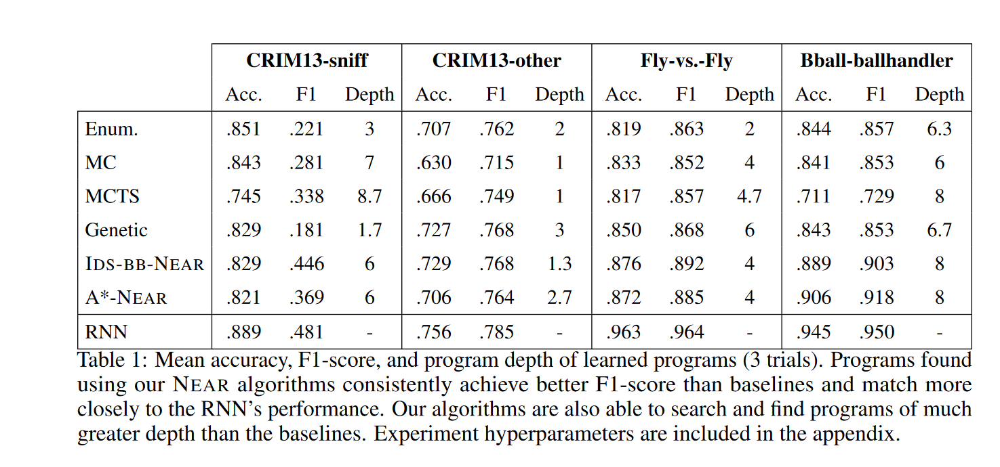

# NEAR
---

# Salient Features

* Problem definition
* DSL Design
* Graph search over programs
* Neural networks as an admissible heuristic
* Experiments
* Results
* Follow-up

---

## Problem definition

* program := $(\alpha, \theta)$
-- $\alpha$ : architecutre sampled from a DSL $X \rightarrow \sigma_1\dots \sigma_k$ where $X$ is a non-terminal and $\sigma$ is a terminal.
-- $\theta$ : parameters of architecture.

* error := $l(\alpha, \theta)$
$$
l(\alpha, \theta) = \mathbb{E}_{(x, y) \in \mathcal{D}} [ \mathbb{I}\{ \alpha(x, \theta) \neq y\}  ]
$$

* structural cost := $s(\alpha)$
-- Cost associated with using $X \rightarrow \sigma_i$ in the architecture $\alpha$

**Training Objective**: Find the architecture and parameters such that:
$$
(\alpha^*, \theta^*) = \arg\min_{\alpha, \theta} (s(\alpha) + l(\alpha, \theta))
$$

---

## DSL Design

Salient Points:
1. DSL specifically for sequence classification tasks. ie: input is an array of real valued vectors.
2. $\oplus_\theta$ : `torch.nn.Linear(input[feature])`. **DSL is differentiable**. Why Linear?
3. Higher order functions.
4. Conditional branching
$$
\text{How to learn programs within this DSL?}
$$
---

## Graph Search 

 - A purely functional program can be seen as a directed acyclic graph (?).
 - We will use graph search techniques to search for a program

 - This will require a heuristic.

---

## Astar

---

## Admissible Heuristic? [(Russel and Norvig)](https://github.com/yanshengjia/ml-road/blob/master/resources/Artificial%20Intelligence%20-%20A%20Modern%20Approach%20(3rd%20Edition).pdf)

---

## Neural network as an admissible heuristic

-- A node in a program graph is of the form $X \rightarrow \sigma_i$.

-- We can use a neural network to approximate this production.

-- A neural network can approximate any function (Universal Approximation Theorem for NN) and *will* be as good as if not better than the production rule $X \rightarrow \sigma_i$.

-- So, NN + structural cost is an admissible heuristic.

---

## A-Star + NEAR

---

## Experiments

-- Scientific discovory for behavior trajectories

---

## Results - Basketball

---

## Results - Mice

---

## Results

---

## Results

