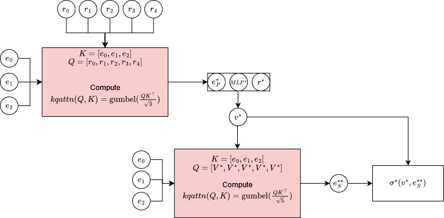

# NPS Diagnosis

---

## Recap

__Last Week__:
- Solution worked out well! This is the first time when multiple interaction modelling has worked out!
- A couple of corner cases that need to be fixed ()
- Questions:
  - __Where does this approach fail?__
    - Corner cases
  - Can we generalize to pairwise interactions?

- __Compositionality across different datasets__

  

  

---

# Compositionality across _keypoints_

    A :
        Train:{0:{}, 1:{}, 2:{}}
        Test: {0:{}, 1:{}, 2:{}}
    B :
        Train:{0:{Stay}, 1:{NS}, 2:{EW}}
        Test: {0:{EW}, 1:{NS}, 2:{Stay}}
    C:
        Train:{0:{NS}, 1:{EW}, 2:{Stay}}
        Test: {0:{}, 1:{}, 2:{}}
    

| Dataset   | Reconstruction Error |
| --------- | -------------------- |
| Dataset A | 0.002884             |
| Dataset B | 0.002149             |
| Dataset C | 0.003016             |

---

---

## Recap:

__Last Week__ : 
- Cannot model interactions $\sigma([k_0, a_0], [k_1, a_1], [k_2, a_2]) \rightarrow k'_0, k'_1, k'_2$:
- Potential Solutions: Hardcode a sphere of influence (pairwise distances) and use it to calculate how "forces" propogate forward.

  

  

---
## Overview

__This Week__:
- Solution worked out well! This is the first time when multiple interaction modelling has worked out!
- A couple of corner cases that need to be fixed ()
- Questions:
  - __Where does this approach fail?__
    - Corner cases
  - __Can we generalize to pairwise interactions?__ (60% Yes?)

  

  

---

__Plot__: The validation set predictions with the highest mean squared error.

1. False positive caused by measuring euclidean distance. Changed to manhattan distance.
2. The model pushes the "triangle" out of bounds. SOI modelling happens every model step while verification only happens at the end of all the model steps.
3. The "out of bounds check" is an approximation.
4. The "triangle" is heavier than the "square" and so the "sqaure goes west" action should fail. However, model doesn't know this.

  

  

---

## Generalizing Pairwise interactions

Euclidean distance is of the form:

$$
D(k_1, k_2) = ||k_i||_2^2 + ||k_j||_2^2 -  2 \cdot k_i^\top k_j
$$
~= 1 scaled gram matrix ($K^\top K$) + two operations on top of the gram matrix.

- Instead of KQ-attention + gumbel softmax, use MHA with atleat `num_keypoint` heads

- Use multiple layers of MHA.

Or:

- Use a stacked-RNN to model interactions across keypoints and time. 

  

  

---

---

## Decision Tree Transformer

<!--  -->

---

# Overview of the last two weeks

- Hypothesis: Compositional generalization across objects and sequences of action requires modular representations and modular transitions.
- Assumptions of NPS:
    - **Modular: Changing one rule shouldn’t impact other rules**
    - Abstract: Rules should cover general patterns.
    - Sparse: Rules should use subset of total entities.
    - Asymmetric: Action and condition cannot be interchanged.
- Last Wednesday=> Can NPS compositionally generalize given a keypoint representation instead of a learned representation?
    - If No, does that mean our hypothesis is incorrect?
    - If Yes, what is different about our approach
- This Wednesday => NPS+Keypoints did not generalize
    - Why? We think because order of application matters much more with keypoints.
      
---
# How does NPS model interactions?

Given:

- A set of embedding vectors: $\{ \mathbf{e_i} \}_{i=1}^\texttt{var}$ where $\texttt{var} = 3$
- A set of rule embeddings,  transformation rules, and production rules $\{(r_i, MLP_i, \sigma_i)\}_{i=1}^\texttt{rules}$ where $\texttt{rules} = 5$

NPS's Algorithm:
$$
\begin{align*}

\textbf{repeat}&\\

\quad \quad (e^{\star}_P, r^\star) &\leftarrow Gumbel(KQAttention(K=[\mathbf{e_1, e_2, e_3}], Q=[\mathbf{r_1, r_2, r_3, r_4, r_5}])_{(3\times 5)} )\\

v^\star &\leftarrow MLP^\star(e^{\star}_P, r^\star)\\

(e^{\star\star}_S, \_) &\leftarrow Gumbel(KQAttention(K=[\mathbf{e_1, e_2, e_3}], Q=[\mathbf{v^\star, v^\star,v^\star,v^\star,v^\star}])_{(3\times 5)} )\\

\hat{e}&\leftarrow \sigma^\star(v^\star, e^{\star\star}_S)
\end{align*}~
$$

---

# How does NPS model interactions (as a figure)

---

# What if $e_i$ are keypoints?

Cannot model interactions $\sigma([k_0, a_0], [k_1, a_1], [k_2, a_2]) \rightarrow k'_0, k'_1, k'_2$:

---

# Diagnosis

- Synthesizing a production system requires learning the guards, the productions, and the order in which they are applied.
- NPS offers a way to learn the guards and productions but the order of application itself is somewhat greedy.
    - The attention mask only takes the *current step* into account while choosing the best rule to apply.
- Example:
    - We have `state=((x=0, y=0, action=left), (x=1, y=0, action=none))`
    - We should ideally move the object at `(1, 0)` first. 
    - However, $Attn(state, (r_0, \dots r_n))$ learns to fires `r_{north}, (0, 0)` first because it has the `(action=left)` label. 
        - This action is correct 95% of the time.

---

# Three possible directions

- Enforcing a transformation where order of application no longer matters.
    - How might NPS+latent embedding model interactions better than NPS+kpts?
    - If we have an orthonormal basis, the order of application does not matter.
    - A large `64` dim hidden vector might be able to encode this internally.

- Enforcing Type Safety
    - We can enforce an extra loss that punishes greedy transitions.
        - ie: Coordinates cannot overlap, 

- Allowing a skip connection for each guard-production rule. $(r_i, MLP_i, \sigma_i, skip)$