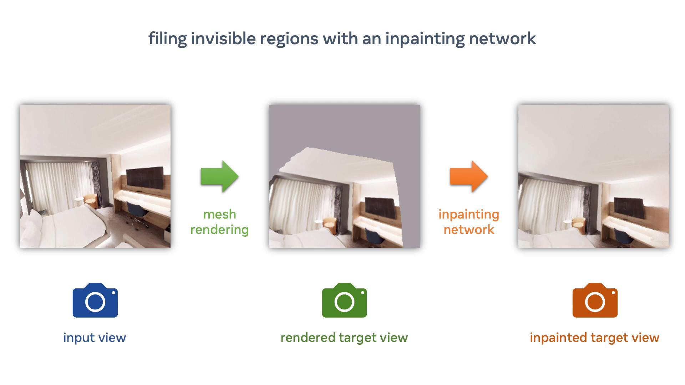
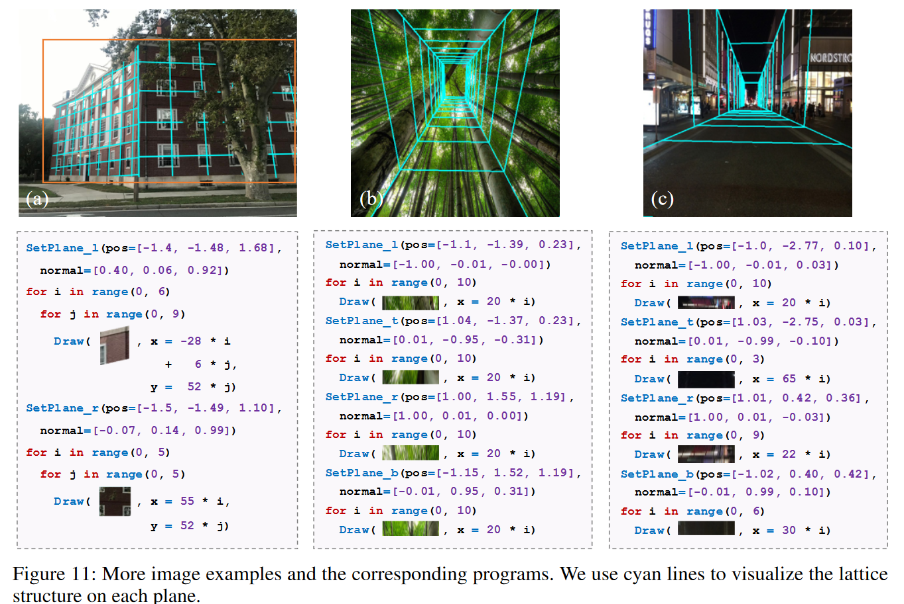
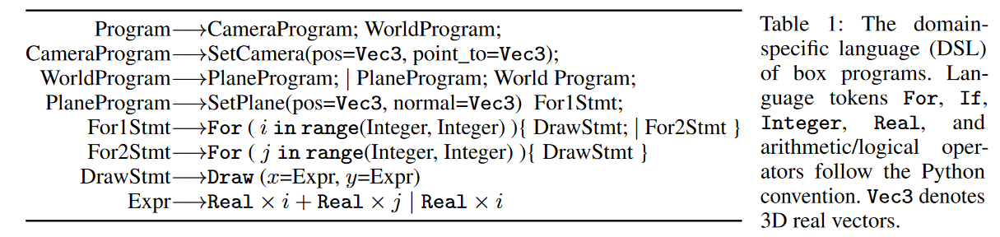
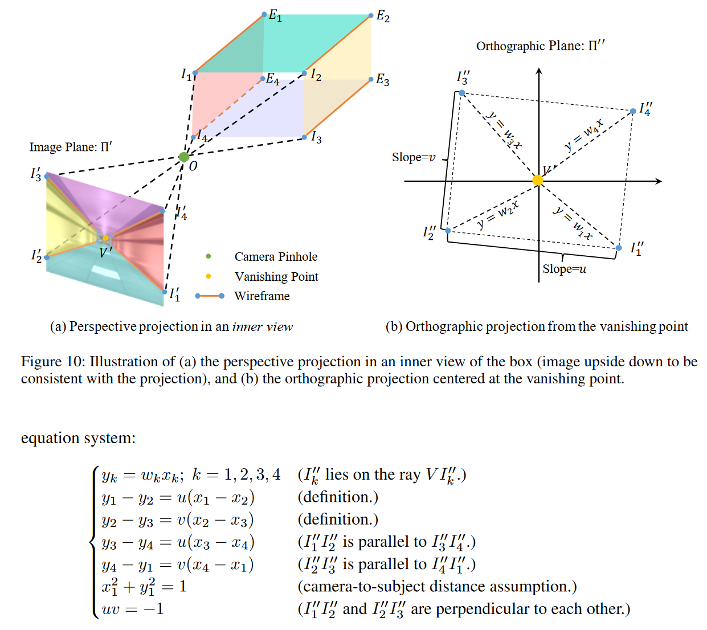
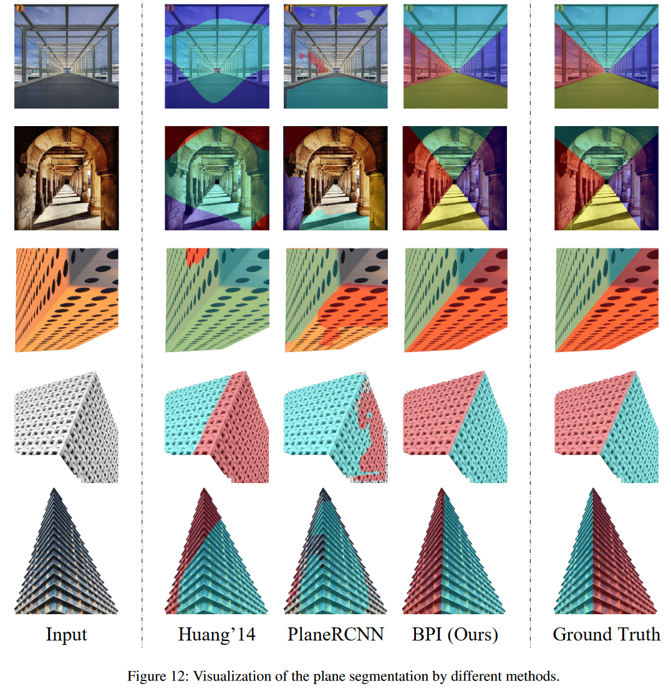
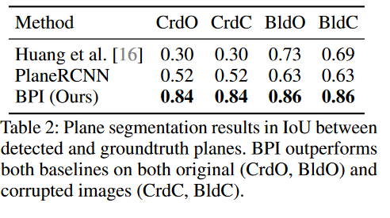
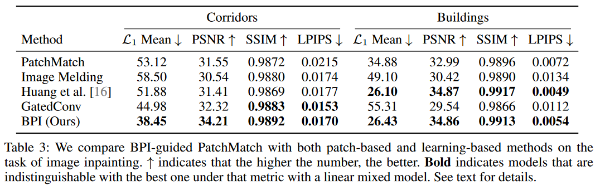
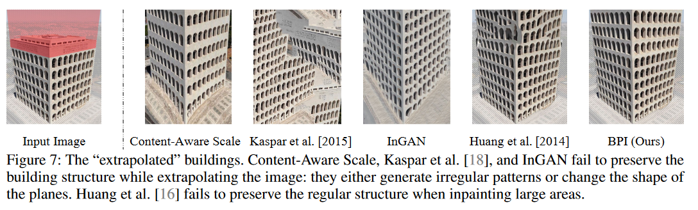
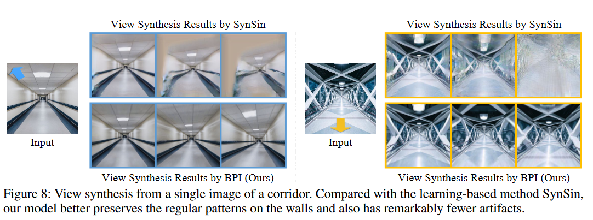

# Reluplex: An Efficient SMT Solver for Verifying Deep Neural Networks
Guy Katz, Clark Barrett, David Dill, Kyle Julian, Mykel Kochenderfer

<footer>
Presented by: Atharva Sehgal

Slides available at: https://atharvas.net/static/reluplex
</footer>

---

## Online

- Overview of Neural Network Verification
    - Birds Eye Perspective
    - RELU Network formulation
    - RELU Network as linear constraints
    <!-- - S1: Explain the problem.
    - S2: Tree (seperated by data)
    - S3: Complete Verification -->
- The Reluplex Algorithm
    - Simplex Algorithm
        <!-- - S4: Simplex Algorithm
        - S5: Example of Simplex Algorithm -->
    - Reluplex as extension of Simplex
        <!-- - S6: What is the extension.
        - S7: Example of Reluplex Algorithm -->
- Analysis
    - Reluplex and the model checking paradigm.
        <!-- - Laziness, Relaxation -->
    - Issues
        <!-- - Deos reluplex occupy a sweet spot in regards to the assumptions it makes and what it hopes to achieve? -->

<!-- Birds eye perspective
Reluplex := Complete + deterministic verification
The Reluplex algorithm
Simplex Algorithm
Example of Simplex Algorithm
RELUPlex Algorithm
Example of RELUPlex Algorithm
Analysis
Does reluplex occupy a sweet spot in regards to the assumptions it makes and what it achieves?
What properties is it exploiting?
Laziness
Lowering expectations
Potential Issues:
Resolved in later works.
Extending reluplex to different architectures.
Unresolved
Can ReLUplex be more lazy. -->

---

## Neural Network Verification

<!-- problem statement for determinsitic and complete verification of neural networks. -->

Given a NN $f$ parametrized by $\theta$, an input pair $(X, y)$, a random labelling function $rand :: y$ We want to show that:
$$
\begin{align*}
\min_x f(\theta, x)_y - f(\theta, x)_{rand(y)} > 0 && \forall y \not\in label(x)
\end{align*}
$$
- "We cannot find a violation to a “minimum margin” between the true prediction and any other prediction for a model."

usage: As surrogate functions. DNN replace lookup tables in aerospace engineering. SHOW DOD PICTURE.

---

## Birds Eye perspective

<footer>
https://sokcertifiedrobustness.github.io/
</footer>

---

<!-- ## Complete Verificaiton -->
<!-- 
Definition 3 (Robustness Verification). An algorithm A is
called a robustness verification, if for any (x0, y0), as long
as there exists x ∈ Bp,(x0) with Fθ (x) 6 = y0 (adversarial
example), A(fθ , x0, y0, ) = false (deterministic verification)
or Pr[A(fθ , x0, y0, ) = false] ≥ 1 − α (probabilistic
verification), where α is a pre-defined small threshold. If
A(fθ , x0, y0, ) = true, we call A provides robustness cer-
tification for model fθ on (x0, y0) against (`p, )-adversary.
Whenever A(fθ , x0, y0, ) = false, if there exists x ∈ Bp,(x0)
with Fθ (x) 6 = y0, A is called complete verification, otherwise
incomplete verification. -->

<!-- ∀(x0,y0)if∃x∈Bpϵ(x0)such thatFθ(x)≠y0,thenA(fθ,x0,y0,ϵ)=false∀(x0​,y0​)if∃x∈Bpϵ​(x0​)such thatFθ​(x)=y0​,thenA(fθ​,x0​,y0​,ϵ)=false

This means that for any input pair (x0, y0), if there exists an adversarial example x in the (`p, )-neighborhood of x0 such that Fθ(x) is not equal to y0, then the algorithm A must return false, indicating that the model is not robust against adversarial examples in the neighborhood of x0. If A returns true, it means that the model is verified to be robust against adversarial examples in the neighborhood of x0. -->

<!-- For a given input pair (x_0, y_0) and a pre-defined small threshold epsilon:

    B_p^{\epsilon}(x_0) represents the (p, epsilon)-neighborhood of x_0, which is the set of all inputs that are within a distance epsilon of x_0 according to the p-norm.

    F_{\theta}(x) represents the output of the neural network model f_theta when given the input x.

    A(f_{\theta}, x_0, y_0, \epsilon) is an algorithm that takes as input the neural network model f_theta, the input pair (x_0, y_0), and the threshold epsilon. The output of this algorithm is either true or false. -->

For datapoints $(x_0, y_0) \in (\mathcal{X} \times \mathcal{Y})$, neural network  $f_{\theta}$, feasible input region $B_p^{\epsilon}(x_0)$, and a threshold $\epsilon$, A complete verification algorithm $\mathcal{A}(f_{\theta}, x_0, y_0, \epsilon)$ shows that:

 <!-- $(x_0, y_0)$ and a pre-defined small threshold $\epsilon$:
- $(x_0, y_0) :=$ The input pair.
- $B_p^{\epsilon}(x_0) :=$ The set of inputs within a distance $\epsilon$ of $x_0$ according to the $p$-norm.
- $f_{\theta}(x)$ represents the output of the neural network model $f_\theta$ for the input $x$.
- $\mathcal{A}(f_{\theta}, x_0, y_0, \epsilon)$ is a NN verifier  -->
<!-- that takes as input the neural network model $f_\theta$, the input pair $(x_0, y_0)$, and the threshold $\epsilon$ and determines whether the neural network is robust to inputs within the "feasible region" defined by $B_p^{\epsilon}(x_0)$. -->

$$    
\begin{align*}
\forall (x_0, y_0), \quad& \exists x \in B_p^\epsilon(x_0)\quad\text{s.t} \quad f_\theta(x) \neq y_0 \\
\implies& \mathcal{A}(f_\theta, x_0, y_0, \epsilon) = \text{false}
\end{align*}
$$

<!-- An algorithm $\mathcal{A}$ is called a robustness verification algorithm, if for any $(x_0, y_0)$, as long as there exists $x \in B_p, \epsilon(x_0)$ with $f_\theta(x) \neq y_0$ (adversarial example), $\mathcal{A}(f_\theta, x_0, y_0, \epsilon) = \text{false}$. If $\mathcal{A}(f_\theta, x_0, y_0, \epsilon) = \text{true}$, we call $\mathcal{A}$ provides robustness certification for model $f_\theta$ on $(x_0, y_0)$ against $(p, \epsilon)$-adversary. -->

<!-- Whenever $\mathcal{A}(f_\theta, x_0, y_0, \epsilon) = \text{false}$, if there exists $x \in B_p, \epsilon(x_0)$ with $f_\theta(x) \neq y_0$, $\mathcal{A}$ is called complete verification, otherwise incomplete verification. -->

---

## ReLU Networks

For some input $x \in \mathcal{X}$, a feedforward neural network $f$ parametrized by $\theta$ is defined by:
$$
\begin{align*}
f_\theta(x) &= \hat{z}_{(l)}\\

s.t.&\begin{cases}
 z_{(1)} = x\\
 \hat{z}_{({i+1})} = \mathbf{W}_iz_{(i)} + b_i & \forall i \in [1, \dots l-1]\\
 z_{({i})} = \sigma(\hat{z}_{(i)}) & \forall i \in [2, \dots l]

\end{cases}
\end{align*}
$$

A ReLU network is a specific instantiation of a feedforward network where the nonlinear function $\sigma$ is $\text{ReLU}(z)$ defined as:
$$
\text{ReLU}(x) = \max(0, x)
$$

The output of a ReLU net is _locally linear_ with respect to the input x.

<footer>
Visualizations from playground.tensorflow.org
</footer>

---
<!-- Fv ,
l∧
i=1
[
Si ⇒
(
vo =
nv
∑
j=1
ci
j · vin,j + bi
)]
The -->
We will use the LRA theory for modelling a neural network. Specifically, in the case of a ReLU network:
- Each matrix multiplication can be encoded as a linear constraint:
$$
l(z_{(l)}, \hat{z}_{(l)} ) = \left( \hat{z}_{(l)} = \sum_{j=1}^{|z_{(l)}|} c_{j} \cdot z_{(l),j} + b \right)
$$
- Each ReLU activation can be encoded as a disjunction:
$$
\text{ReLU}(\hat{z}_{(l)}, z_{(l)} ) = \left( z_{(l)} > 0 \implies \hat{z}_{(l)} = z_{(l)} \right) \land \left( z_{(l)} \leq 0 \implies \hat{z}_{(l)} = 0 \right)
$$

---

$$
\begin{align*}
x + y &\geq 4\\
y &\geq 2
\end{align*}
$$

.

$$
\begin{align*}
x + y &= s\\
y &\geq 2\\
s &\geq 4
\end{align*}
$$

<!-- $$
\begin{align*}
s_1 &= x + y \\
s_1 &\geq 4\\
y &\geq 4
\end{align*}
$$ -->

---

## Thoery Solver: Linear Rational Arithmetic

Specifically, the simplex algorithm.

Intuition. Simplex working on a small example.

However, this only worked out well for us because the order was fixed.

---

## Simplex Form

Example on the running example. Use slack variables
basic variable
non-basic variable

Convince yourself that, with this form, the ordering will always allow us to terminate.

---

## Reluplex algorithm

Naive Algorithm: Use Simplex as theory solver with a generic  directly on relu conditions.
Each relu condtion affects the relu dependencies later in the network. exponential blowup.

Intuition: We will only case split when necessary.

---

## 

---

---

## Motivation

- Task: Single Image View Synthesis
- Challenge: Learning scene decompositions is, generally, underspecified.
- Observation: Physical objects display a measure of uniformity.
- Hypothesis: Can we impose a structural prior to capture this uniformity?
- Use a "box prior"
    - Pinhole camera
    - $\exists \text{ 4 planes if inside else 2 planes}$
    - Each plane has repeating pattern.

---

## Sample Box Programs

---

## Algorithm

---

## Step 3 - Plane Recticiation

---

### Step 4 - Fitness Ranking

---

## Evaluation

**Dataset**
- 44 Corridor images, 42 Buildings.
- Collected by Google Images
- Handmade mask for end of the corridor
- Handmade mask for building.

**Tasks**
- Plane Segmentation
- Image Inpainting
- Image Extrapolation
- View Synthesis

---

### Plane Segmentation (Quantitiave Evaluation)

---

### Image Inpainting (Quantitiave Evaluation)

---

### Image Extrapolation (Qualitative Evaluation)

Randomly select 15 images and ask 15 participants to rank outputs.
- `61%` BPI (This Paper)
- `16%` Context-Aware Scaling
- `2%` Kaskar et al.
- `16%` InGAN
- `5%` Huang'14 

---

### View Synthesis (Qualitative Evaluation)

Randomly select 20 images from 3 trajectories and ask 10 participants to rank outputs.
- `100%` prefer BPI on Trajectory 1
- `94%` prefer BPI on Trajectory 2
- `99.5%` prefer BPI on Trajectory 3

---

### Failure Cases

---

### Failure Cases (?)

<!-- 

## Problem Definition

- 
- For box priors: given an input image, we want to setment the image into different planes, estimate their surface normals relative to the camera and infer the regular patterns.

 -->

---

## Interesting papers

 - Perspective plane program induction framework
 - The unreasonable Effectiveness of Deep networks as a Perceptual Metric.
