# Multi-Plane Program Induction with 3D Box Priors
Yikai Li*, Jiayuan Mao*, Xiuming Zhang, William T. Freeman, Joshua B. Tenenbaum, Noah Snavely, Jiajun Wu

---
<!-- 
## Overview
* Motivation
* Problem definition
* Algorithm
* Experiments
* Results
- Discussion: 
    - Does this approach solve the problem?
    - Significance for Computer Vision
    - Significance for Program Synthesis

--- -->

## Motivation

- Task: Single Image View Synthesis
- Challenge: Learning scene decompositions is, generally, underspecified.
- Observation: Physical objects display a measure of uniformity.
- Hypothesis: Can we impose a structural prior to capture this uniformity?
- Use a "box prior"
    - Pinhole camera
    - $\exists \text{ 4 planes if inside else 2 planes}$
    - Each plane has repeating pattern.

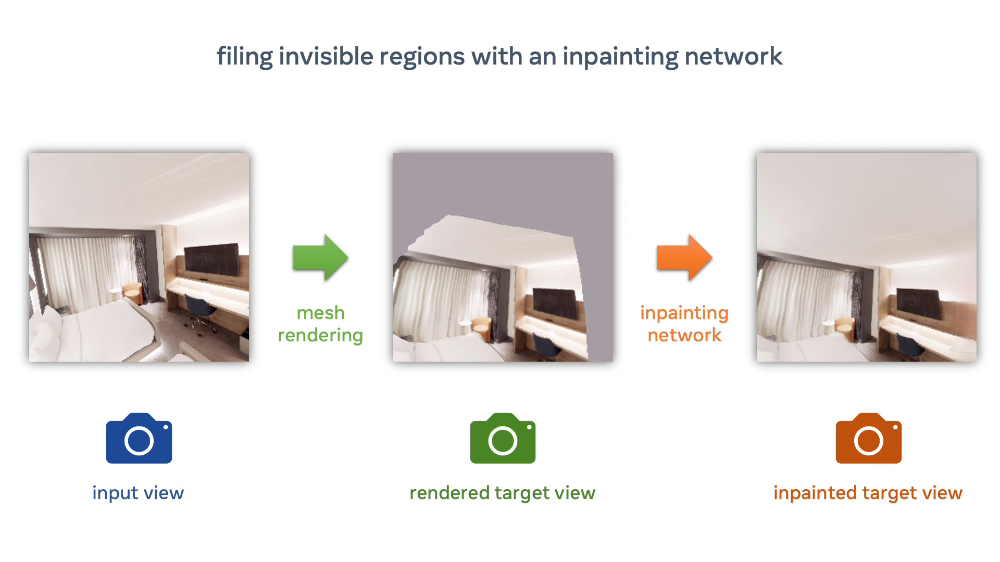

---

## Sample Box Programs

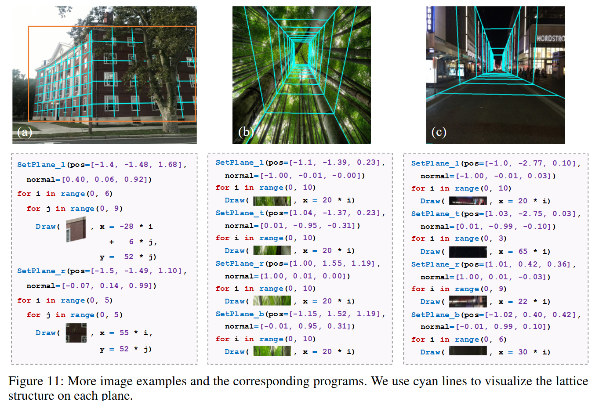
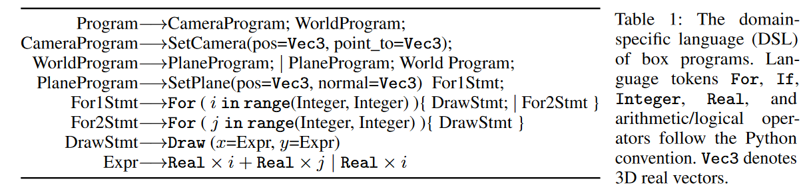

---

## Algorithm

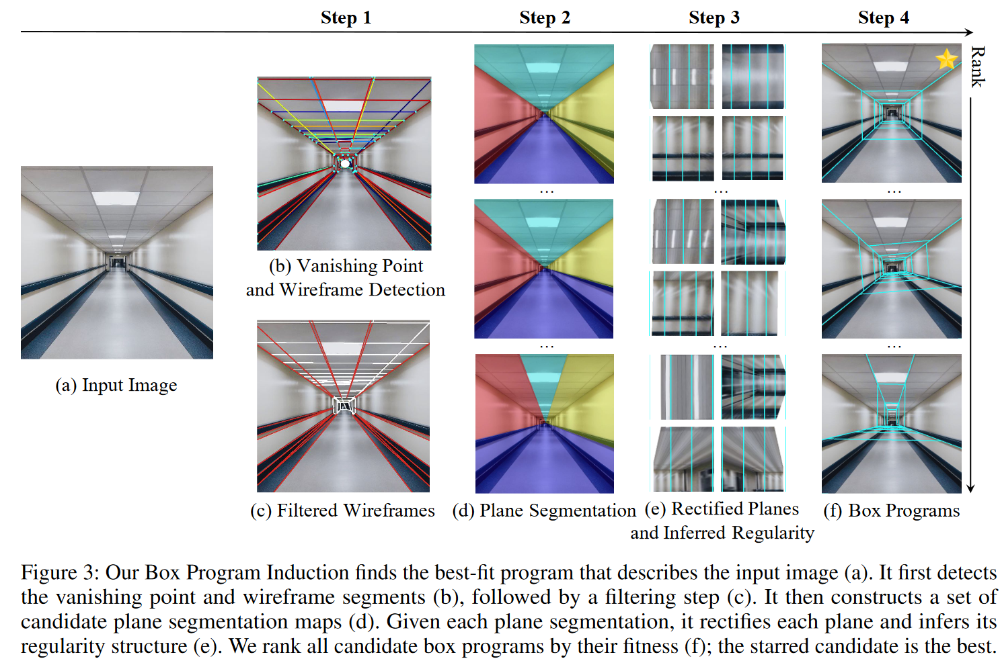

---

## Step 3 - Plane Recticiation

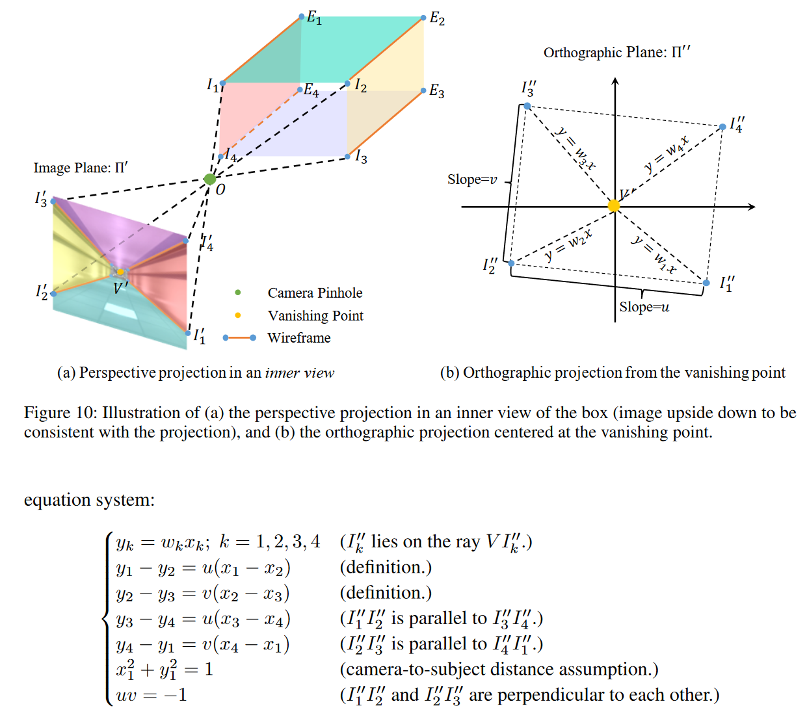

---

### Step 4 - Fitness Ranking

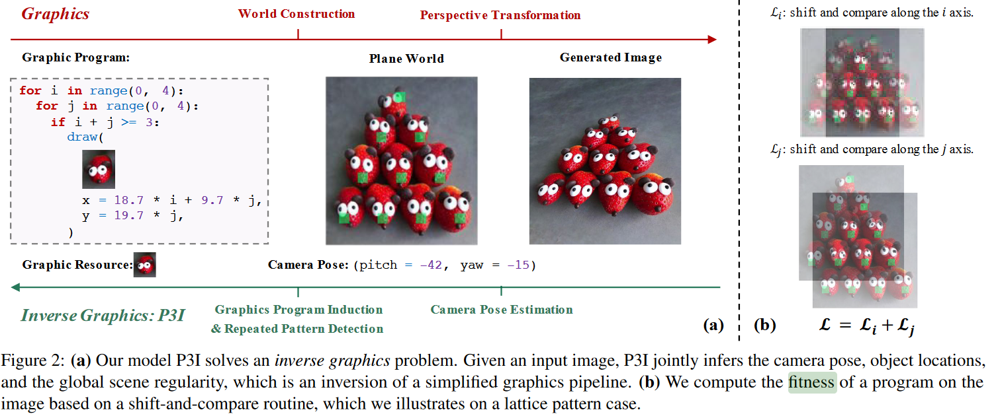

---

## Evaluation

**Dataset**
- 44 Corridor images, 42 Buildings.
- Collected by Google Images
- Handmade mask for end of the corridor
- Handmade mask for building.

**Tasks**
- Plane Segmentation
- Image Inpainting
- Image Extrapolation
- View Synthesis

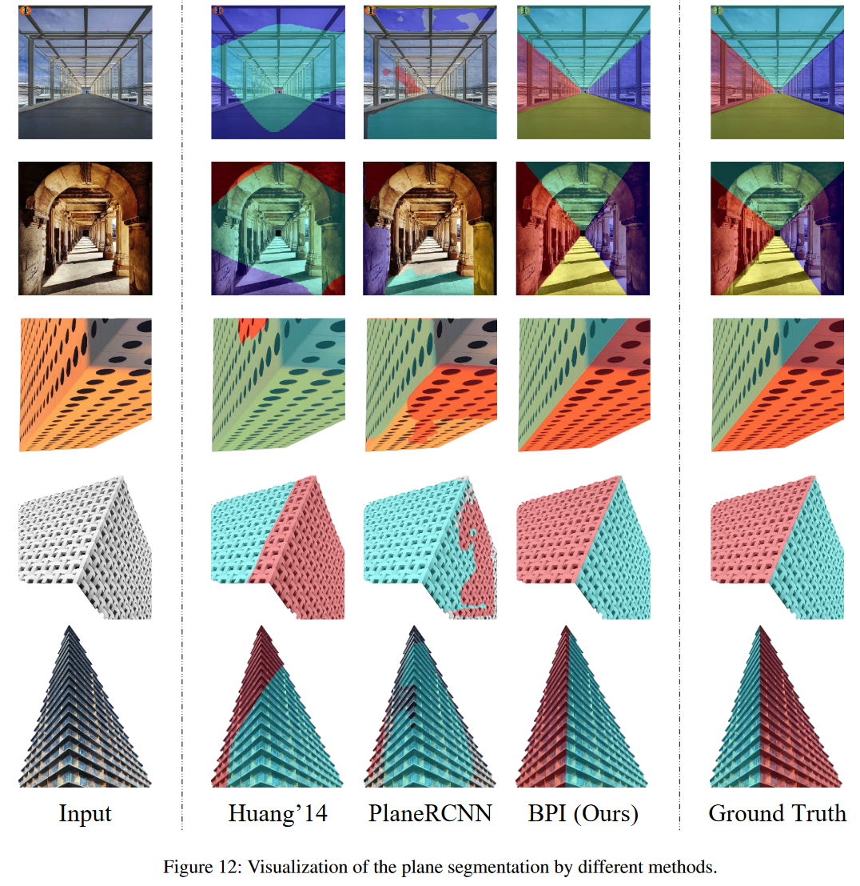

---

### Plane Segmentation (Quantitiave Evaluation)

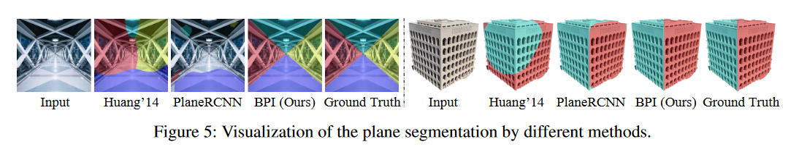
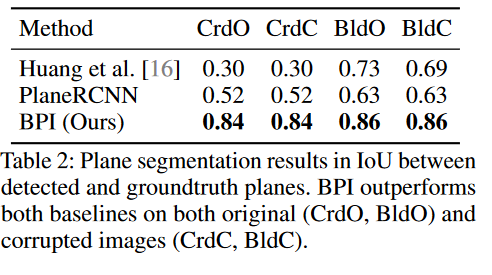

---

### Image Inpainting (Quantitiave Evaluation)

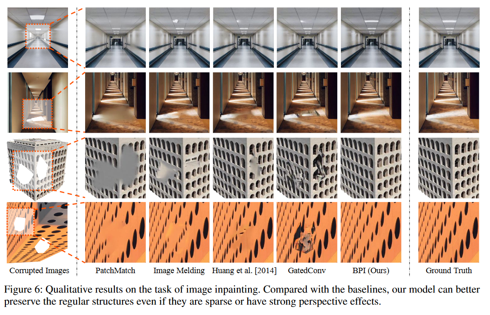

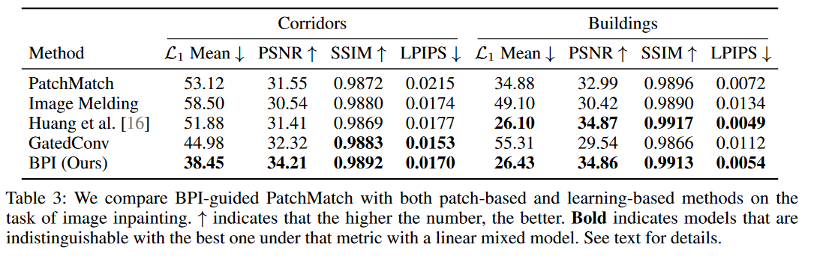

---

### Image Extrapolation (Qualitative Evaluation)

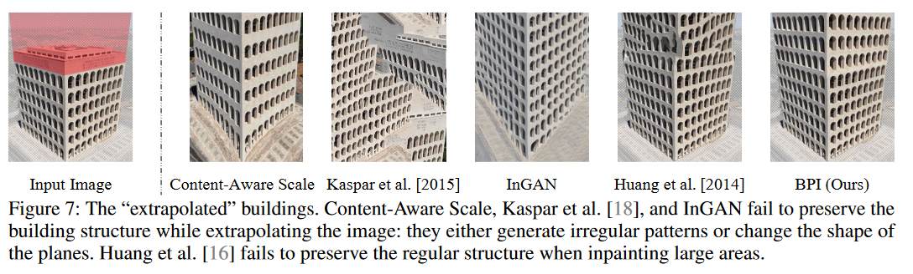

Randomly select 15 images and ask 15 participants to rank outputs.
- `61%` BPI (This Paper)
- `16%` Context-Aware Scaling
- `2%` Kaskar et al.
- `16%` InGAN
- `5%` Huang'14 

---

### View Synthesis (Qualitative Evaluation)

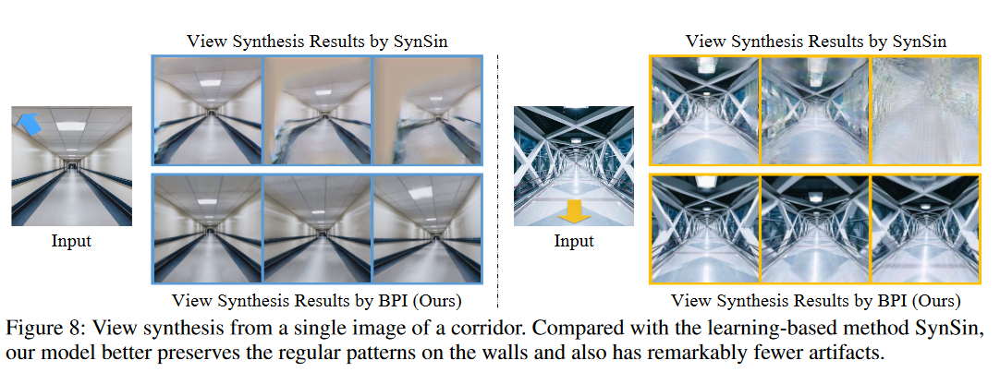

Randomly select 20 images from 3 trajectories and ask 10 participants to rank outputs.
- `100%` prefer BPI on Trajectory 1
- `94%` prefer BPI on Trajectory 2
- `99.5%` prefer BPI on Trajectory 3

---

### Failure Cases

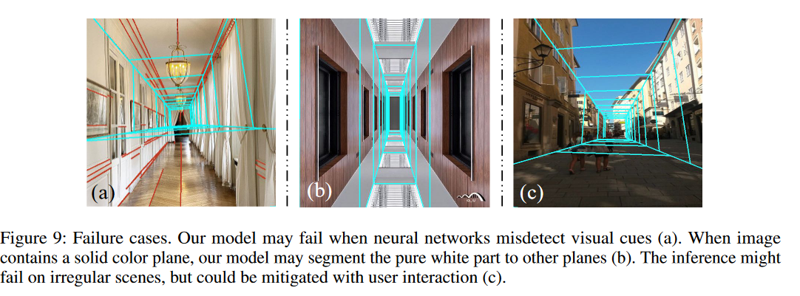

---

### Failure Cases (?)

<!-- 

## Problem Definition

- 
- For box priors: given an input image, we want to setment the image into different planes, estimate their surface normals relative to the camera and infer the regular patterns.

 -->

---

## Interesting papers

 - Perspective plane program induction framework
 - The unreasonable Effectiveness of Deep networks as a Perceptual Metric.
