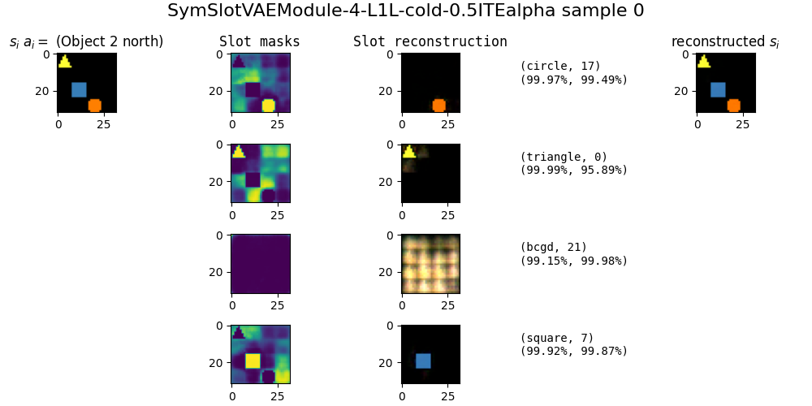

# Slot Attention with rule learning

---

# Agenda:
 - Slot attention decoder
 - DSL
 - (Extra) Biological fluid dynamics (https://arxiv.org/abs/1904.13013)

---

# Slot Attn Decoder

<center>


</center>

---

# Changes


Changes:
 - Use smoothL1 loss instead of L1 loss.
 - Use the same loss function for matching and backprop.

<!-- 

<style> .container { display: flex; } .col { flex: 1; } </style>

<div class="container"> <div class="col">
Pipeline:

</div>
<div class="col">
Training curve:

</div>
</div> -->

---
# Slot Attn Decoder

Training Curve


---

# Sample 0

<center>



</center>

---

# Sample 1

<center>


</center>

---

# Sample 2

<center>


</center>

---

# Dealing with multiple objects

```ocaml

S0: s_i |> (enc) |> (slot)                                       (dec) |> s_{i+1}
S1:                        |> (entitiy dec) |> (a_i) |> (???) |>
```


---

# dPads

- Given a differentiable DSL, dPads aims to derive a program that maps an input stream to an output stream. 

- $$\arg\min_{\theta,\alpha} \mathbb{E}_{\mathbf{i, o} \in D} [l(P(\mathbf{i}; \alpha, \theta), \mathbb{o})] + c(\alpha) $$
- alpha is a program derivation graph


---

# DSL

Inputs:
```python
pos :: [int, int]
color :: int
shape :: {circ, sq, tri}
slot :: [color, shape, pos]
```


---

# (Extra) Fluid Dynamics
https://arxiv.org/abs/1904.13013


