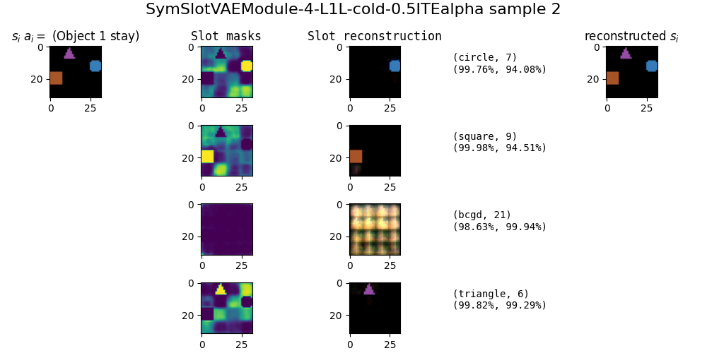

# Unsupervised Neural Representation Learning

---

# Agenda:
 - Recap
 - How does slot attention handle occlusion:
    - Dataset
    - Results
 - Do symbolic rules "help" the vision system.
 - Next Steps
---

<!-- # Recap
- Slot Attention w/ gumbel softmax:
    - Dynamical learning with slot attention is  


--- -->
## Slot Attention - Occlusion Dataset

<center>


</center>

---
### Results

<center>


</center>

---

# Fixed Symbolic Rules

- Pure DNN based approaches struggle to disassociate shapes with colors.
    - The (shape, color) pairs in training is different from (shape, color) pairs in testing.
    - Sample 1 on next slide shows an effect of this disassociation on a purely neural model (with no rules).
- Hypothesis: Given a fixed transition function, can a hybrid neurosymbolic model produce better reconstructions and converge faster than a purely symbolic model.
    - Three models:
        - A vanilla resnet autoencoder reconstructiong $(s_i, a_i) \rightarrow (s_{i+1})$
        - A slot attention based autoencoder (with an MLP for the transition layer) reconstructiong $(s_i, a_i) \rightarrow (s_{i+1})$
        - A slot attention based autoencoder (with a fixed symbolic program for the transition layer) reconstructiong $(s_i, a_i) \rightarrow (s_{i+1})$

---

# Sample 1

<center>


</center>

---

# Dataset

<center>


</center>

---

# Next steps
 - Slot Attention w/ Occlusion on mice domain.
    - MABE Videos.
 - Results for the symbolic rule hypothesis.


 ---

 # Slides from Last Week

 ---

 # Slot Attn Decoder

<center>


</center>

---

# Changes


Changes:
 - Use smoothL1 loss instead of L1 loss.
 - Use the same loss function for matching and backprop.

<!-- 

<style> .container { display: flex; } .col { flex: 1; } </style>

<div class="container"> <div class="col">
Pipeline:

</div>
<div class="col">
Training curve:

</div>
</div> -->

---
# Slot Attn Decoder

Training Curve


---

# Sample 0

<center>


</center>

---

# Sample 1

<center>


</center>

---

# Sample 2

<center>



</center>

---

# Dealing with multiple objects

```ocaml

S0: s_i |> (enc) |> (slot)                                       (dec) |> s_{i+1}
S1:                        |> (entitiy dec) |> (a_i) |> (???) |>
```


---

# dPads

- Given a differentiable DSL, dPads aims to derive a program that maps an input stream to an output stream. 

- $$\arg\min_{\theta,\alpha} \mathbb{E}_{\mathbf{i, o} \in D} [l(P(\mathbf{i}; \alpha, \theta), \mathbb{o})] + c(\alpha) $$
- alpha is a program derivation graph


---

# DSL

Inputs:
```python
pos :: [int, int]
color :: int
shape :: {circ, sq, tri}
slot :: [color, shape, pos]
```


