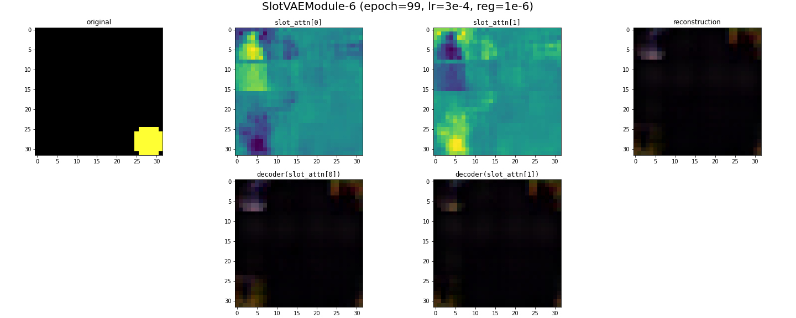

# Programmatic Generation

---

# Recap

Slot attention + a simple MLP seems to be able to learn the dynamics of the shapeworld environment for certain instances. 

__This Week__: Focused on where this fails, how this fails under the "single sphere" dataset.

---

# Single Sphere Dataset

Train time:

---

# Single Sphere Dataset

Test time:

---

# Overfitting

---

# Single Shapes Dataset

Train time:

---

# Single Shapes Dataset

Test time:

---

