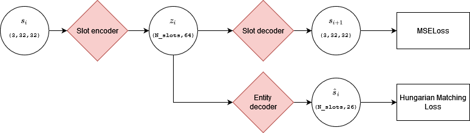
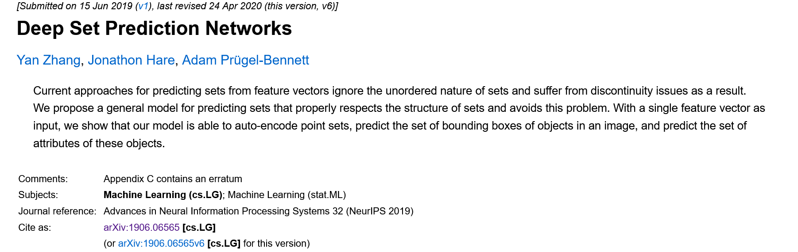
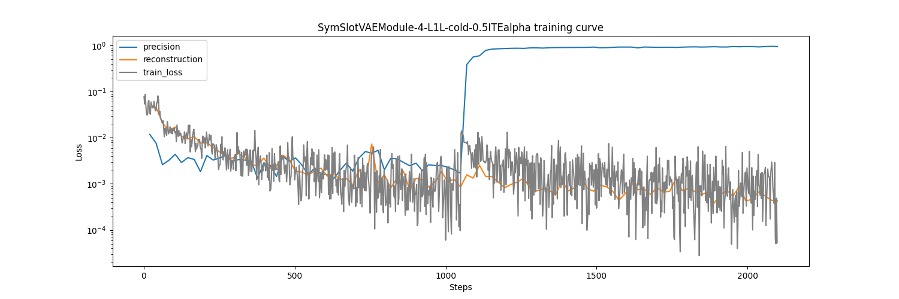
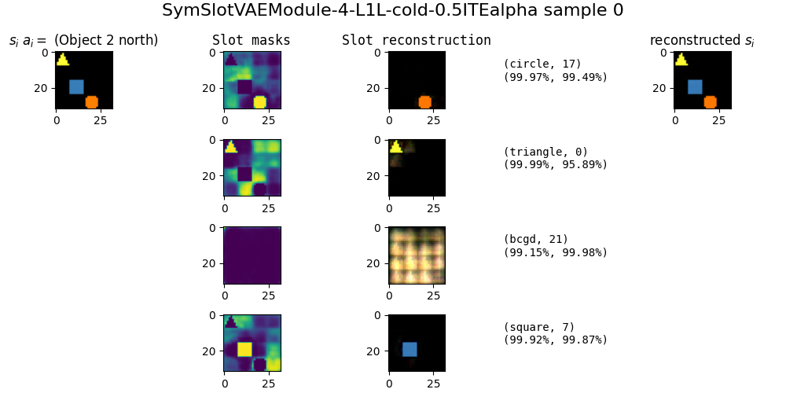
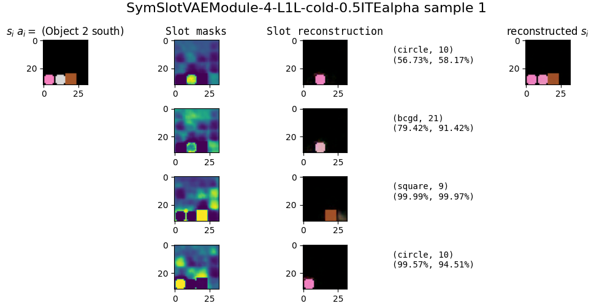
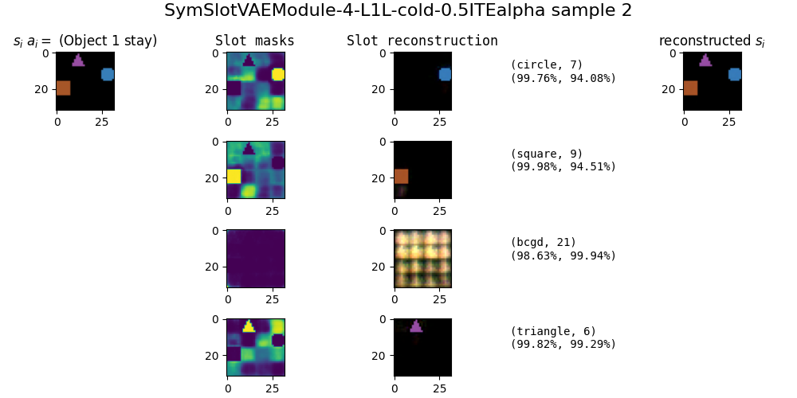
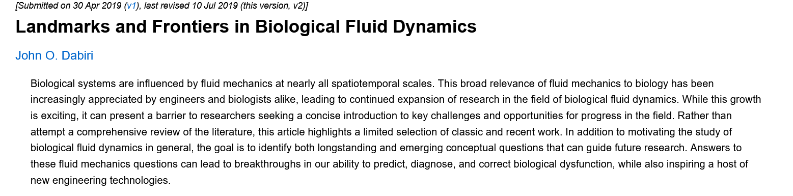

# Slot Attention with rule learning

---

# Agenda:
 - Slot attention decoder
 - DSL
 - (Extra) Biological fluid dynamics (https://arxiv.org/abs/1904.13013)

---

# Slot Attn Decoder

<center>



</center>

---

# Changes



Changes:
 - Use smoothL1 loss instead of L1 loss.
 - Use the same loss function for matching and backprop.

<!-- 

<style> .container { display: flex; } .col { flex: 1; } </style>

<div class="container"> <div class="col">
Pipeline:

</div>
<div class="col">
Training curve:

</div>
</div> -->

---
# Slot Attn Decoder

Training Curve



---

# Sample 0

<center>



</center>

---

# Sample 1

<center>



</center>

---

# Sample 2

<center>



</center>

---

# DSL

Inputs:
```python
pos :: [int, int]
color :: int
shape :: {circ, sq, tri}
slot :: [color, shape, pos]
```


---

# (Extra) Fluid Dynamics
https://arxiv.org/abs/1904.13013


